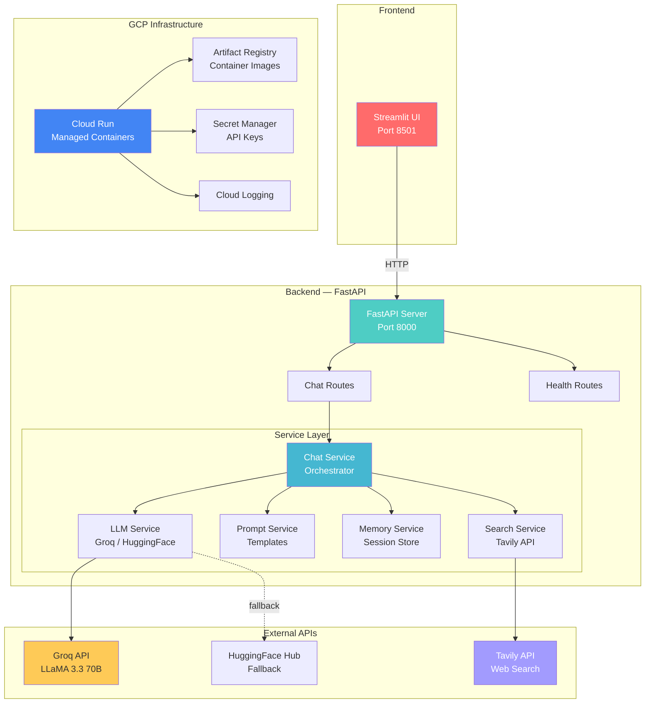

# 🤖 AI ChatBot

A production-ready, context-aware conversational AI chatbot system built with **LangChain**, **FastAPI**, **Streamlit**, and deployable to **GCP Cloud Run**.

---

## 🏗 Architecture



---

## ✨ Features

| Feature | Description |
|---------|-------------|
| 🧠 **Multi-turn Memory** | Windowed conversation buffer keeps last K turns |
| 🌐 **Web Search** | Real-time Tavily search augments responses with current info |
| ⚡ **Fast Inference** | Groq API for near-instant LLM responses |
| 🔄 **Auto-Fallback** | Falls back to HuggingFace if Groq is unavailable |
| 🎯 **Session Isolation** | Multiple users get separate conversation contexts |
| 📜 **History API** | Full CRUD for conversation history |
| 🐳 **Dockerized** | Separate containers for backend + frontend |
| 🚀 **CI/CD Pipeline** | Jenkins → SonarQube → Artifact Registry → Cloud Run |

---

## 📦 Project Structure

```
AI-ChatBot/
├── backend/
│   ├── main.py                 # FastAPI app factory
│   ├── config.py               # Pydantic Settings (env vars)
│   ├── models/
│   │   └── schemas.py          # Request/response Pydantic models
│   ├── routes/
│   │   ├── chat.py             # /chat, /history endpoints
│   │   └── health.py           # /health endpoint
│   └── services/
│       ├── llm_service.py      # LLM factory (Groq/HuggingFace)
│       ├── prompt_service.py   # Chat prompt templates
│       ├── memory_service.py   # Session-based conversation memory
│       ├── search_service.py   # Tavily web search integration
│       └── chat_service.py     # Main chat orchestrator
├── frontend/
│   └── app.py                  # Streamlit chat UI
├── tests/
│   ├── conftest.py             # Pytest fixtures (mocked LLM)
│   ├── test_health.py          # Health endpoint tests
│   ├── test_chat.py            # Chat + history endpoint tests
│   └── test_services.py        # Memory & prompt service tests
├── docker/
│   ├── Dockerfile.backend      # Backend Docker image
│   └── Dockerfile.frontend     # Frontend Docker image
├── jenkins/
│   └── Jenkinsfile             # CI/CD pipeline (GCP)
├── infra/
│   ├── main.tf                 # GCP Cloud Run / Artifact Registry / Secret Manager
│   ├── variables.tf            # Terraform variables
│   └── outputs.tf              # Terraform outputs
├── docker-compose.yml          # Local development
├── requirements.txt            # Python dependencies
├── sonar-project.properties    # SonarQube config
├── .env.example                # Environment template
└── README.md                   # This file
```

---

## 🚀 Quick Start

### Prerequisites

- Python 3.11+
- API keys (at least one LLM provider):
  - **Groq** *(recommended)*: [console.groq.com](https://console.groq.com)
  - **HuggingFace** *(fallback)*: [huggingface.co/settings/tokens](https://huggingface.co/settings/tokens)
  - **Tavily** *(web search)*: [app.tavily.com](https://app.tavily.com)

### 1. Setup

```bash
# Clone and enter the project
cd AI-ChatBot

# Create virtual environment
python -m venv venv
source venv/bin/activate  # Linux/Mac
# venv\Scripts\activate   # Windows

# Install dependencies
pip install -r requirements.txt

# Configure environment
cp .env.example .env
# Edit .env and add your API keys
```

### 2. Run Backend

```bash
uvicorn backend.main:app --reload --host 0.0.0.0 --port 8000
```

The API is now available at `http://localhost:8000`. Try:
- Docs: `http://localhost:8000/docs`
- Health: `http://localhost:8000/health`

### 3. Run Frontend

```bash
# In a new terminal
streamlit run frontend/app.py
```

The chat UI opens at `http://localhost:8501`.

---

## 🐳 Docker

### Build & Run

```bash
# Copy and configure environment
cp .env.example .env
# Edit .env with your API keys

# Build and start both services
docker-compose up --build

# Access:
# - Frontend: http://localhost:8501
# - Backend:  http://localhost:8000
# - API Docs: http://localhost:8000/docs
```

### Stop

```bash
docker-compose down
```

---

## 🔌 API Reference

### `POST /chat`

Send a message and get an AI response.

```bash
curl -X POST http://localhost:8000/chat \
  -H "Content-Type: application/json" \
  -d '{
    "message": "What is LangChain?",
    "session_id": "my-session",
    "use_web_search": true
  }'
```

**Response:**
```json
{
  "response": "LangChain is a framework for developing applications powered by language models...",
  "session_id": "my-session",
  "web_search_used": true,
  "model": "llama-3.3-70b-versatile",
  "timestamp": "2025-01-01T00:00:00Z"
}
```

### `GET /history/{session_id}`

Fetch conversation history.

### `DELETE /history/{session_id}`

Clear a session's history.

### `GET /health`

System health check.

---

## 🧪 Testing

```bash
# Run all tests
python -m pytest tests/ -v

# With coverage
python -m pytest tests/ -v --cov=backend --cov-report=html
```

Tests use mocked LLM services — **no API keys required** to run tests.

---

## ☁️ GCP Deployment

### Prerequisites

1. [Google Cloud SDK](https://cloud.google.com/sdk/docs/install) installed
2. A GCP project with billing enabled
3. API keys stored in Secret Manager

### Infrastructure (Terraform)

```bash
cd infra

# Authenticate
gcloud auth application-default login

# Deploy
terraform init
terraform plan -var="gcp_project_id=your-project-id"
terraform apply -var="gcp_project_id=your-project-id"
```

This creates:
- **Artifact Registry** — Docker image repository
- **Cloud Run** — Managed backend + frontend services (scale-to-zero!)
- **Secret Manager** — Secure API key storage
- **IAM** — Least-privilege service account
- **Cloud Logging** — Centralized logging

### Manual Deploy (without Terraform)

```bash
# Set project
export PROJECT_ID=your-project-id
export REGION=us-central1

# Authenticate Docker with Artifact Registry
gcloud auth configure-docker ${REGION}-docker.pkg.dev

# Create Artifact Registry repo
gcloud artifacts repositories create ai-chatbot-repo \
  --repository-format=docker --location=${REGION}

# Build & push backend
docker build -f docker/Dockerfile.backend -t ${REGION}-docker.pkg.dev/${PROJECT_ID}/ai-chatbot-repo/backend:latest .
docker push ${REGION}-docker.pkg.dev/${PROJECT_ID}/ai-chatbot-repo/backend:latest

# Build & push frontend
docker build -f docker/Dockerfile.frontend -t ${REGION}-docker.pkg.dev/${PROJECT_ID}/ai-chatbot-repo/frontend:latest .
docker push ${REGION}-docker.pkg.dev/${PROJECT_ID}/ai-chatbot-repo/frontend:latest

# Deploy backend to Cloud Run
gcloud run deploy ai-chatbot-backend \
  --image=${REGION}-docker.pkg.dev/${PROJECT_ID}/ai-chatbot-repo/backend:latest \
  --region=${REGION} --platform=managed --allow-unauthenticated \
  --port=8000 --set-env-vars="GROQ_API_KEY=your-key,TAVILY_API_KEY=your-key"

# Get backend URL
BACKEND_URL=$(gcloud run services describe ai-chatbot-backend --region=${REGION} --format='value(status.url)')

# Deploy frontend to Cloud Run
gcloud run deploy ai-chatbot-frontend \
  --image=${REGION}-docker.pkg.dev/${PROJECT_ID}/ai-chatbot-repo/frontend:latest \
  --region=${REGION} --platform=managed --allow-unauthenticated \
  --port=8501 --set-env-vars="BACKEND_URL=${BACKEND_URL}"
```

### CI/CD (Jenkins)

The `jenkins/Jenkinsfile` defines a full pipeline:

1. **Install** → Python dependencies
2. **Lint** → Ruff code quality
3. **Test** → Pytest with coverage reporting
4. **SonarQube** → Static analysis + quality gate
5. **GCP Auth** → Activate service account
6. **Docker Build & Push** → Parallel builds to Artifact Registry
7. **Deploy Cloud Run** → Deploy backend + frontend (main branch only)

---

## 🔐 Environment Variables

| Variable | Required | Description |
|----------|----------|-------------|
| `GROQ_API_KEY` | ✅ (or HF) | Groq API key for fast LLM inference |
| `HUGGINGFACEHUB_API_TOKEN` | ✅ (or Groq) | HuggingFace Hub API token (fallback) |
| `TAVILY_API_KEY` | Optional | Tavily API key for web search |
| `LLM_MODEL_NAME` | Optional | Model name (default: `llama-3.3-70b-versatile`) |
| `LLM_TEMPERATURE` | Optional | Temperature (default: `0.7`) |
| `MEMORY_WINDOW_SIZE` | Optional | Conversation history window (default: `10`) |
| `BACKEND_URL` | Optional | Backend URL for frontend (default: `http://localhost:8000`) |
| `GCP_PROJECT_ID` | For deploy | Google Cloud project ID |
| `GCP_REGION` | For deploy | GCP region (default: `us-central1`) |

---

## 🛠 Tech Stack

| Layer | Technology |
|-------|-----------|
| **LLM Orchestration** | LangChain (LCEL) |
| **Primary LLM** | Groq (LLaMA 3.3 70B) |
| **Fallback LLM** | HuggingFace Hub |
| **Web Search** | Tavily API |
| **Backend** | FastAPI + Uvicorn |
| **Frontend** | Streamlit |
| **Testing** | Pytest |
| **Linting** | Ruff |
| **Code Quality** | SonarQube |
| **Containers** | Docker + Docker Compose |
| **CI/CD** | Jenkins |
| **Cloud** | GCP (Cloud Run, Artifact Registry, Secret Manager) |
| **IaC** | Terraform |

---

## 📄 License

MIT
